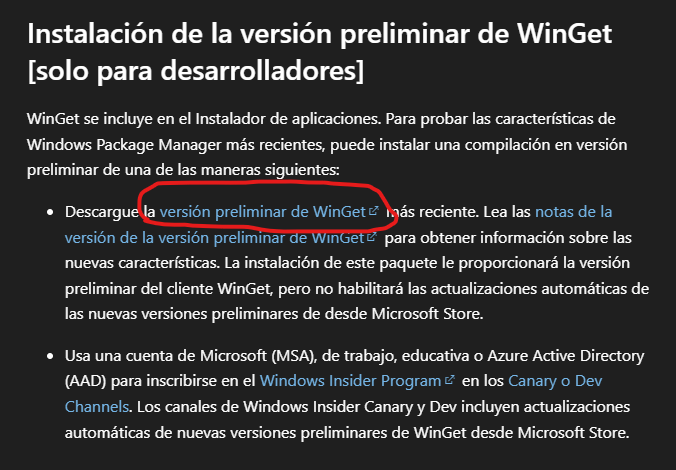
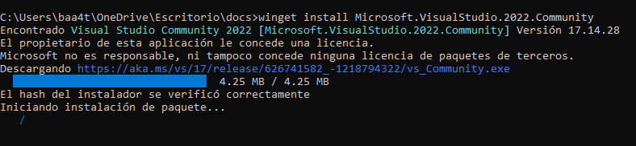
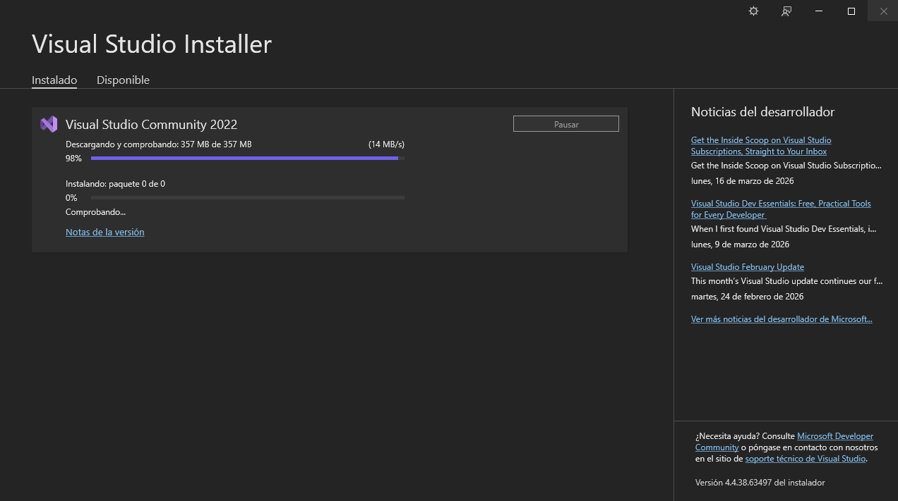
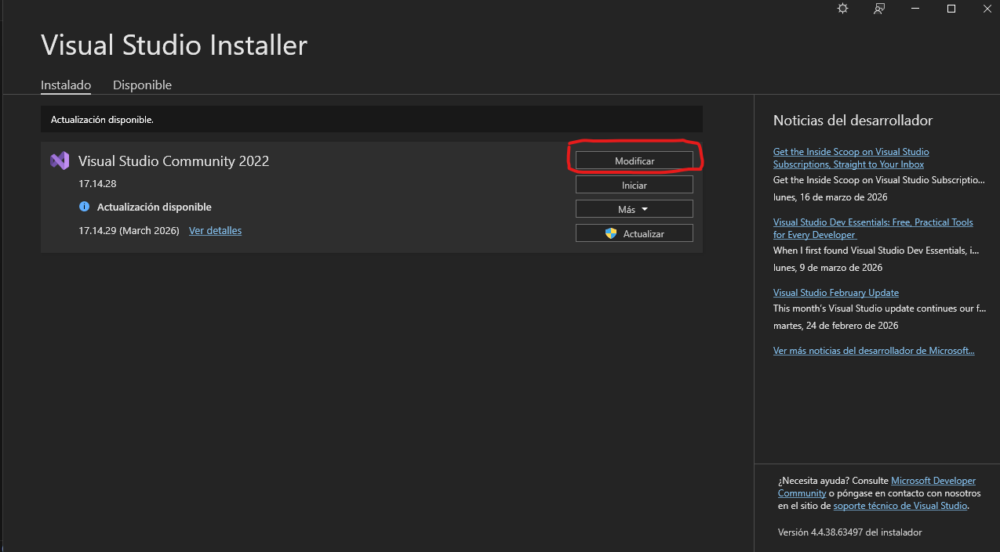
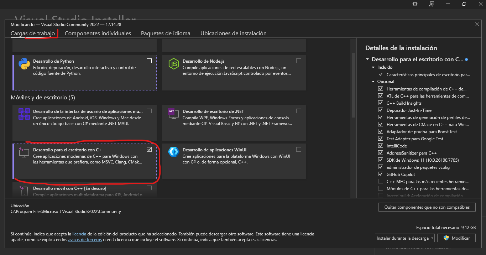
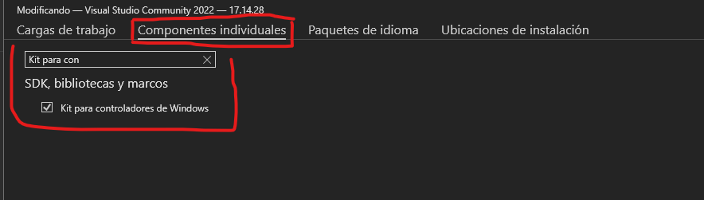
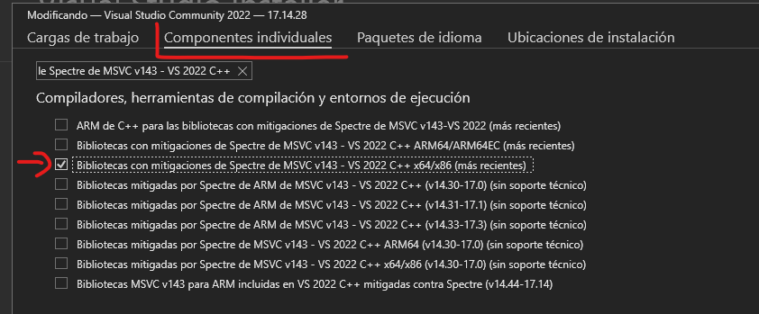
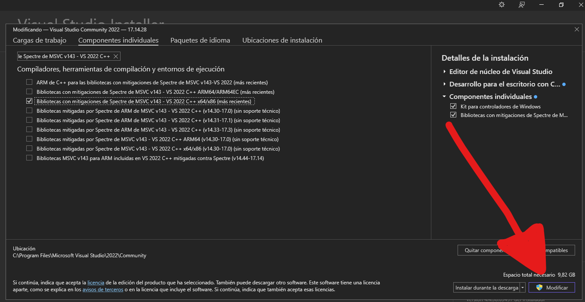

# Windows Kernel Driver Developer
Guía simple de cómo configurar un entorno para desarrollar drivers de Windows en `C/C++`

#### Índice
- 1 Configurar gestor de paquetes de Windows
- 2 Visual Studio y WDK


---

### Sección 1 - Configurar gestor de paquetes de Windows
`winget` ¿qué es? Es la herramienta de línea de comandos de Microsoft para gestionar e instalar paquetes en Windows, es la alternativa a las herramientas de los sistemas Linux. Por ejemplo:
- `pacman -S` Distribuciones basadas en Arch Linux
- `apt install` Distribuciones basadas en Debian
- `dnf install` Distribuciones basadas en Red Hat

En el caso de Windows, `winget` es su equivalente.

#### Instalación de `winget`
Primero tener instaladas las dependencias necesarias de cualquier sistema Windows (Nota: si formateaste tu PC es obligatorio, de lo contrario puede que ya las tengas)

  - [C++ Redistributable](https://learn.microsoft.com/en-us/cpp/windows/latest-supported-vc-redist?view=msvc-170#latest-supported-redistributable-version)

Descargá la versión para tu arquitectura x86/x64.

Ahora sí, comprobar si ya tenemos instalado `winget` o si está dañado utilizando el comando `winget --version`, debería salir algo similar a:
> C:\Users\baa4t>winget --version  
> v1.29.30-preview

De lo contrario debemos descargarlo. Ir al siguiente link y descargar la versión preliminar más reciente (primera opción, marcada en la imagen):

- [Winget Descarga](https://learn.microsoft.com/es-es/windows/package-manager/winget/#install-winget-preview-version-developers-only)




---

### Sección 2 - Visual Studio y WDK

Ahora mediante `winget` se puede realizar la instalación del IDE `Microsoft Visual Studio 2022`.

En la terminal de preferencia (cmd/PowerShell):
```bash
winget install Microsoft.VisualStudio.2022.Community
```

`winget` descargará el bootstrapper y lanzará el **Visual Studio Installer** automáticamente:



El installer se encargará de descargar e instalar todos los componentes necesarios:



Al finalizar la instalación el installer se cerrará solo.

#### Configuración de Visual Studio

Una vez finalizada la instalación, abrir el **Visual Studio Installer**:

1. Presionar la tecla `Windows`
2. Escribir: `Visual Studio Installer`
3. Presionar `Enter`

Al abrirse mostrará la versión instalada. Hacer click en **"Modificar"** para seleccionar los componentes necesarios:



Se abrirá el menú de **Cargas de trabajo**. Seleccionar **"Desarrollo para el escritorio con C++"**:



Luego ir a la pestaña **Componentes individuales** e instalar los siguientes dos componentes:

**Kit para controladores de Windows** — buscarlo escribiendo `Kit para controladores de Windows` en el buscador:



**Bibliotecas con mitigaciones de Spectre** — buscarlo escribiendo `Bibliotecas con mitigaciones de Spectre de MSVC v143 - VS 2022 C++` y seleccionar la opción `x64/x86 (más recientes)`:



Como paso final, hacer click en **"Modificar"** y aceptar los permisos de administrador:

